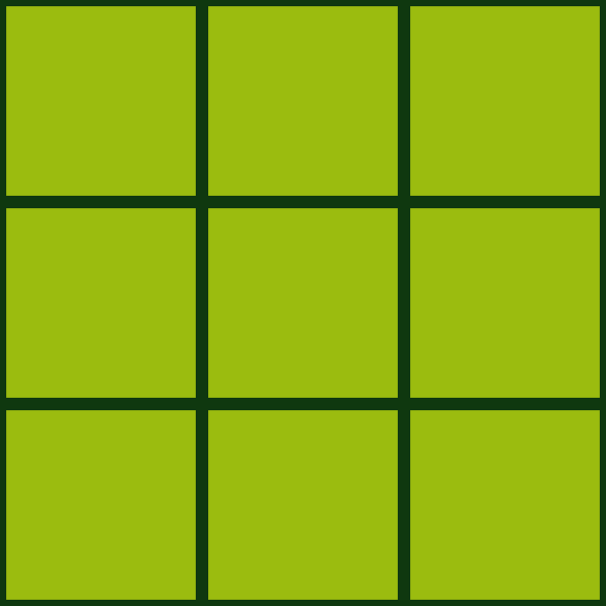

# Tic Tac Toe Qt/C++
 The popular Tic Tac Toe game written in the Qt/C++ framework.
 
## Screenshots


## Installing
A step by step series  that tell you how to get a execute project.
Get it from GitHub
```
git clone git@github.com:Przemekkkth//tic-tac-toe-qt.git
```
Compile
```
qmake && make
```
## Addons
* [Qt](https://www.qt.io/) - Cross-Platform software for embedded & desktop
* [Font](https://www.dafont.com/early-gameboy.font) - dafont website
